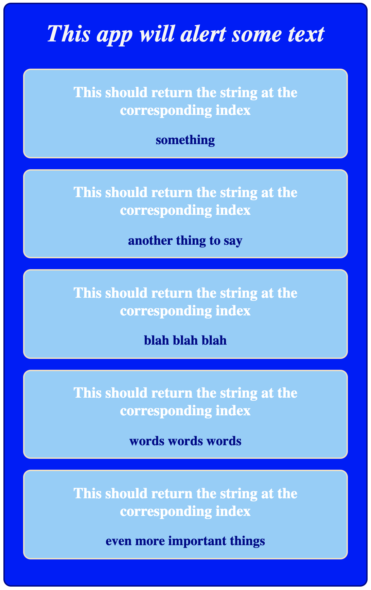

Trial 1, The Broken React App

Here you get a golden opportunity to flex those problem solving muscles, by using what you know about coding to fix this app!  The app when finished should beautifully display all of the element stored in the apps state in thier own nifty little containers. When you have finished debugging you will have an app that looks like the image below. 

Some of the problems will give you console logs, while the majority of them will not (or not useful ones anyways).  You will need to develop a thoughtful approach to solving these types of problems, or establish one while you work through the this exercise. 

Make sure to challenge what you think you know about what you think is going on, and take your time to read the code.  Follow the trail of information and fix the app.  Good luck!!!

to get started:

1. npm install
2. npm run build (builds bundle.js)
3. npm start (If using the provided server use "npm run server" instead)
4. go to localhost:8008 in your browser to see the first problem

